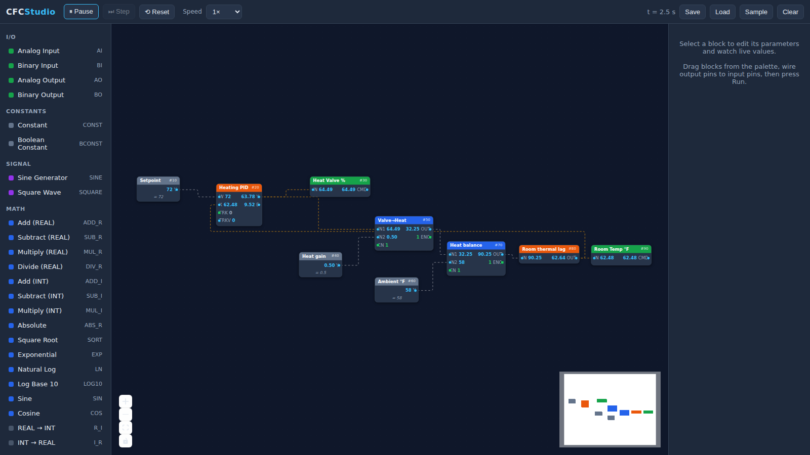
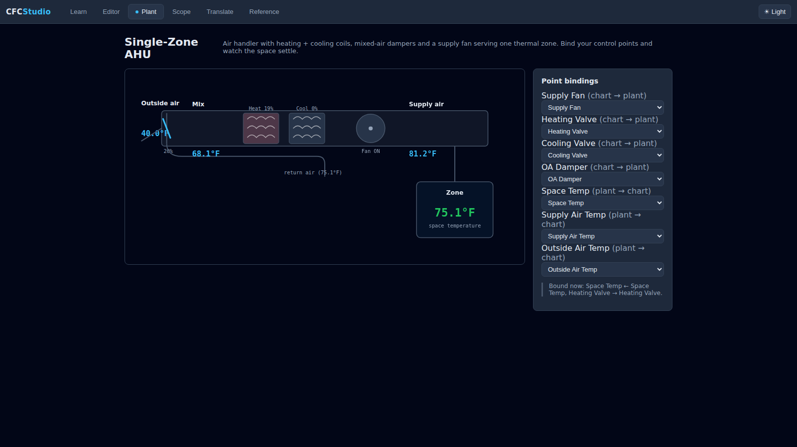

# CFC Studio

A browser-based **visual editor and simulator** for Siemens **CFC** (Continuous
Function Chart) — the graphical, function-block control language used by
**Desigo PXC** field panels that is replacing **PPCL** (Powers Process Control
Language) on the older APOGEE platform.

Drag function blocks onto a chart, wire their pins together, press **Run**, and
watch live values propagate through the logic exactly as a panel re-solves its
chart every cycle. It's built for engineers migrating PPCL programs to CFC who
want a sandbox to prototype and understand block behaviour without a controller.



## A multi-tab training studio

CFC Studio is organised as a tabbed studio (a "flight simulator for Siemens
building controls"):

| Tab | What it does |
|---|---|
| **Learn** | Guided, auto-checked curriculum that drives the real editor *(roadmap)* |
| **Editor** | Build & simulate charts — the working home base |
| **Plant** | Live animated AHU the chart actually controls, closed-loop — **live now** |
| **Scope** | Oscilloscope / data recorder for pin values over time — **live now** |
| **Translate** | PPCL → CFC migration bench *(roadmap)* |
| **Reference** | Auto-generated block datasheets with provenance badges — **live now** |

Try it: open the **Plant** tab → **Load AHU demo chart** → **Run simulation** (bump
the Editor speed to 20×) and watch the heating PID settle the zone at setpoint,
with the heating coil glowing and the fan spinning. Flip to **Scope** to see the
same run as live traces.



Light & dark themes, persisted across sessions.

### Honesty layer (provenance)

Every block is stamped **Confirmed** (verified against Siemens/IEC docs),
**Inferred** (modelled from the documented equivalent — exact Desigo spec not
public), or **Non-Siemens** (a simulator convenience). The badge shows in the
palette, the inspector, and the Reference datasheets, so the tool teaches what
it knows and flags what it doesn't — an authoritative-looking trainer that
taught a wrong pin would be worse than nothing.

## Features

- **Visual editor** — drag-and-drop blocks (React Flow canvas), wire output
  pins to input pins, pan/zoom, minimap.
- **Cyclic solver** — re-solves the whole chart each cycle in execution-sequence
  order, with proper **feedback-loop handling** (loop-closing wires carry the
  previous cycle's value, like a real panel). Feedback wires are drawn dashed
  amber.
- **Live simulation** — Run / Pause / single-Step / Reset, with a speed
  multiplier. Every pin shows its current value on the node and in the inspector.
- **Siemens-accurate block library** — block names, pins and semantics follow
  the documented SIMATIC/Desigo CFC libraries (`ADD_R`, `CMP_R`, `SEL_R`,
  `SR_FF`, `TON`, `LOOP`, …), including the **EN/ENO** enable/valid pins that
  every elementary block carries.
- **Inspector** — edit parameters and drive input points (analog/binary inputs)
  live while the simulation runs.
- **Save / Load** charts as JSON, plus a built-in sample heating loop.

## Block library

Blocks are organised by category in the palette:

| Category | Blocks |
|---|---|
| **I/O** | `AI` `BI` `AO` `BO` (analog/binary input & output points) |
| **Constants / Signal** | `CONST` `BCONST` `SINE` `SQUARE` |
| **Math** | `ADD_R` `SUB_R` `MUL_R` `DIV_R` `ADD_I` `SUB_I` `MUL_I` `ABS_R` `SQRT` `EXP` `LN` `LOG10` `SIN` `COS`, conversions `R_I` `I_R` `R_B` `B_R` |
| **Logic** | `AND` `OR` `NAND` `NOR` `XOR` `NOT` |
| **Compare** | `CMP_R` `CMP_I` (single block, six relational outputs GT/GE/EQ/NE/LE/LT) |
| **Selectors** | `SEL_R` `SEL_BO` `MUX_R` `MAX_R` `MIN_R` `LIM_R` |
| **Timers** | `TON` `TOF` `TP` `TONR` |
| **Counters** | `CTU` `CTD` `CTUD` |
| **Memory** | `SR_FF` `RS_FF` `R_TRIG` `F_TRIG` |
| **Control** | `LOOP` (PID) `INT_P` `DIF_P` `PT1_P` `RAMP_P` `HYST` |

See [`docs/CFC-reference.md`](docs/CFC-reference.md) for the execution model,
detailed block semantics, the PPCL→CFC migration map, and sourcing notes
(what is confirmed from Siemens docs vs. inferred from IEC 61131-3).

## Getting started

```bash
npm install
npm run dev      # start the dev server (http://localhost:5173)
```

Other scripts:

```bash
npm run build      # type-check + production build to dist/
npm run preview    # serve the production build
npm test           # run the engine unit tests (vitest)
```

The app loads a sample **heating PID loop** on first open: a `LOOP` controller
holds a simulated room at its 72 °F setpoint by modulating a heating valve,
with a small first-order "plant" model (`MUL_R` → `ADD_R` → `PT1_P`) feeding the
room temperature back to the controller. Press **Run** to watch it settle.

## Deploy to Vercel

CFC Studio is a static Vite build, which Vercel auto-detects (a `vercel.json`
pins the settings explicitly). To put it online:

1. Go to **[vercel.com/new](https://vercel.com/new)** and **Import** the
   `cfc_studio` GitHub repository (authorize Vercel for the repo if prompted).
2. Vercel detects the framework as **Vite** — Build Command `npm run build`,
   Output Directory `dist`. Leave the defaults and click **Deploy**.
3. In **Settings → Git**, set the **Production Branch** to the branch you want
   live (e.g. `main`, or `claude/wonderful-mendel-eqqvrb`). Every push to that
   branch redeploys; other branches get preview URLs.

Or from your own machine with the Vercel CLI:

```bash
npm i -g vercel
vercel        # first run links the project and creates a preview
vercel --prod # promote to your production domain
```

There's no backend, environment variable, or database to configure — it's a
pure client-side app.

## How the simulation works

Each cycle the solver:

1. Orders blocks by their **execution sequence number**, refined by data-flow
   topology so a block reads the freshest available value of its inputs.
2. Marks any wire that closes a loop (or leaves a stateful block such as a
   timer, integrator or flip-flop) as a **feedback edge** — it carries last
   cycle's value, which is how integrators, PID and latches work on real
   hardware.
3. Evaluates each block, honouring `EN` (skip & hold when disabled) and
   reporting validity on `ENO`.

`dt` (the simulated seconds per cycle) and a speed multiplier are configurable
from the toolbar.

## Architecture

```
src/
  engine/
    types.ts          Core type system (pins, blocks, eval context)
    simulator.ts      The cyclic solver (ordering, feedback, EN/ENO)
    sample.ts         The built-in demo chart
    blocks/           Data-driven block library (one file per category)
      index.ts        Registry — add new blocks here
      elementary.ts   EN/ENO wrapper for elementary blocks
      math.ts logic.ts compare.ts selectors.ts timers.ts
      counters.ts memory.ts control.ts convert.ts io.ts sources.ts
  store/
    chartStore.ts     Zustand store bridging React Flow ⇄ the simulator
  components/
    Canvas.tsx Toolbar.tsx Palette.tsx Inspector.tsx BlockNode.tsx
```

### Adding a block

Append a `BlockDefinition` to a category file (or a new one) and import it in
`engine/blocks/index.ts`. The palette, node renderer, inspector and solver are
all data-driven, so the UI picks it up automatically — no component changes
needed. Example:

```ts
elementary({
  type: 'MOD_R',
  name: 'Modulo (REAL)',
  category: 'Math',
  description: 'OUT = IN1 mod IN2.',
  inputs: [
    { id: 'in1', name: 'IN1', type: 'REAL', default: 0 },
    { id: 'in2', name: 'IN2', type: 'REAL', default: 1 },
  ],
  outputs: [{ id: 'out', name: 'OUT', type: 'REAL' }],
  evaluate: ({ inputs }) => ({ out: Number(inputs.in1) % Number(inputs.in2) }),
});
```

## Status & roadmap

This is a working first version. Natural next steps:

- Trend/chart panel to plot pin values over time.
- More HVAC-specific blocks (enthalpy/psychrometrics, optimum start/stop,
  economizer, equipment rotation) once exact Desigo block specs are confirmed.
- Import of CFC charts exported from ABT Site / TIA (XML), reconstructing the
  run sequence.
- A PPCL→CFC assist that suggests block equivalents for pasted PPCL.

## Disclaimer

CFC Studio is an independent educational/simulation tool. It is **not**
affiliated with or endorsed by Siemens, and block behaviour is a best-effort
reconstruction from public documentation and IEC 61131-3 — not a
bit-for-bit emulation of panel firmware. Do not rely on it for life-safety or
production control decisions. "Siemens", "Desigo", "APOGEE", "PXC" and "PPCL"
are trademarks of their respective owners.
